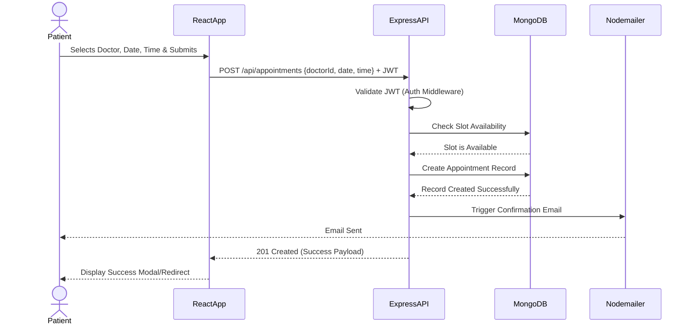

# High-Level Design (HLD): MediSync Healthcare Platform

## 1. System Architecture Overview

MediSync follows a standard Client-Server architecture utilizing the MERN stack (MongoDB, Express.js, React.js, Node.js). 

```mermaid
graph TD
    Client[Client (React/Vite)] <--> |HTTPS / REST API| Server[Server (Node.js/Express.js)]
    
    Server <--> |Mongoose ODM| DB[(MongoDB)]
    
    Server --> |Upload/Retrieve| Cloudinary[Cloudinary (File Storage)]
    Server --> |SMTP| Nodemailer[Nodemailer (Email Service)]
    
    subgraph External Services
        Cloudinary
        Nodemailer
    end
    
    subgraph Infrastructure
        Client
        Server
        DB
    end
```

## 2. Component Description

### 2.1 Client-Side (Frontend)
- **Framework**: React.js bootstrapped with Vite for fast HMR and optimized builds.
- **Routing**: `react-router-dom` handles navigation (e.g., `/login`, `/dashboard`, `/appointments`).
- **State Management**: React Context API combined with standard React Hooks (`useState`, `useEffect`) handles global and local state (e.g., user authentication state, loaded appointments).
- **Responsibilities**: 
  - Rendering UI/UX.
  - Form validation (client-side).
  - Communicating with backend REST APIs via `fetch` or `axios`.
  - Storing JWT tokens securely (e.g., LocalStorage or HTTP-only cookies).
- **Deployment Target**: Vercel (providing CDN distribution and CI/CD).

### 2.2 Server-Side (Backend)
- **Framework**: Node.js runtime with Express.js framework.
- **API Paradigm**: RESTful API design serving JSON payloads.
- **Responsibilities**:
  - Request routing and validation.
  - Business logic execution (e.g., checking appointment slot availability).
  - Authentication and Authorization using JWT and Bcryptjs.
  - Interfacing with the database.
  - Interfacing with third-party services (Cloudinary, Email).
- **Deployment Target**: Render or Railway.

### 2.3 Database (Storage layer)
- **Engine**: MongoDB (NoSQL Document Database).
- **ODM**: Mongoose is used for schema definition, validation, and querying.
- **Responsibilities**: Persistent storage of Users, Appointments, Medical Records, Prescriptions, etc.
- **Deployment Target**: MongoDB Atlas (Cloud-hosted DBaaS).

### 2.4 External Integrations
- **Cloudinary**: Used for storing binary large objects (BLOBs) such as User Profile Pictures and Medical Documents/Reports. The backend handles the secure upload via API keys and stores the resulting secure URL in MongoDB.
- **Nodemailer**: Used for transactional emails (e.g., Registration confirmation, Appointment booking success, Password resets).

## 3. Data Flow Diagram: Appointment Booking



## 4. Security Architecture

1. **Authentication**: Handled via JSON Web Tokens (JWT). Upon successful login, the server issues a JWT. The client must include this token in the `Authorization` header as a Bearer token for protected routes.
2. **Password Protection**: Plain text passwords are never stored. `bcryptjs` is used to salt and hash passwords before saving them to the database.
3. **Authorization (RBAC)**: Role-Based Access Control is implemented via middleware. A user's role (`patient`, `doctor`, `admin`) is embedded in their JWT payload and verified before allowing access to role-specific endpoints (e.g., only `admin` can verify a doctor).
4. **Environment Variables**: Sensitive credentials (DB URI, Cloudinary secrets, JWT secret) are injected via `.env` files and never committed to source control.
